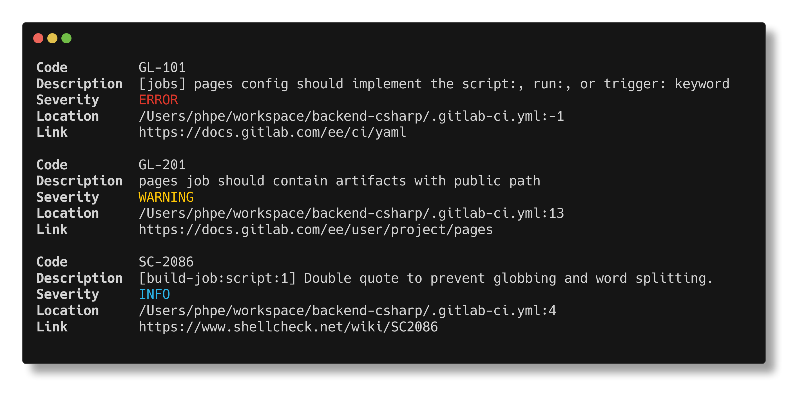
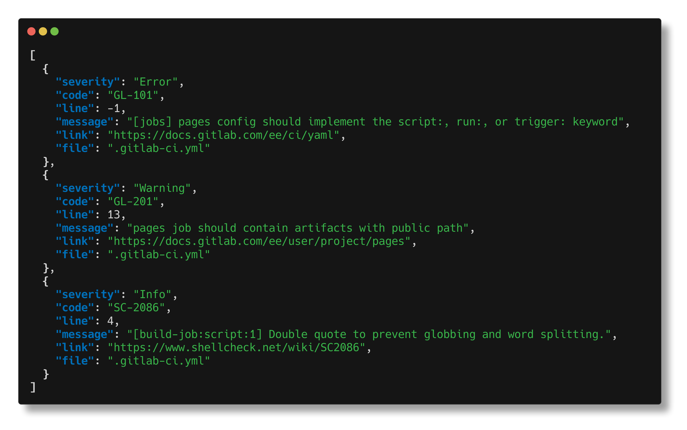
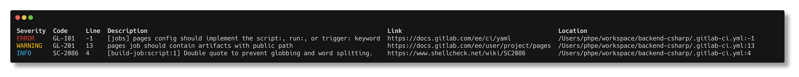

Home
===

<figure markdown="span">
{ width="250" }
</figure>

Validate and lint your gitlab ci files using ShellCheck, the Gitlab API, curated checks or even build your own checks

## Features

- ShellCheck for scripts
- Validation against Pipeline Lint API for project
- Curated checks for common mistakes (feel free to [contribute new ones](./extending/Add_check.md))
- Automatic detection of the current gitlab project with an option to overwrite
- Available as pre-commit hook
- Usable to valid dynamically generated pipelines using the [python wrapper](./installation.md#install-as-library-using-pip)
- Support for *gitlab.com* and self-hosted instances
- Support for [custom policies](extending/Writing_custom_policies.md) written
  in [Rego](https://www.openpolicyagent.org/docs/latest/policy-language/)
- Resolve and validate includes ([more information on how it works and limitations](how-it-works/Include_resolution.md))

## Supported platforms

The following platforms are supported (and have prebuilt binaries /
ready-to-use integration):

- Linux
    - 64-bit
    - ARM 64-bit
- Darwin
    - 64-bit
    - ARM (M1/M2)
- Windows
    - 64-bit
- pre-commit (x86 & ARM)
- Docker (x86 & ARM)
- GitLab CI Template (for easy integration in GitLab CI/CD)

!!! info

    For installation instructions refer to [Installation](./installation.md).

### Example output

gitlab-ci-verify supports a variety of outputs.

| Format |                          Screenshot                           |
|:-------|:-------------------------------------------------------------:|
| text   |    |
| json   |    |
| table  |  |
